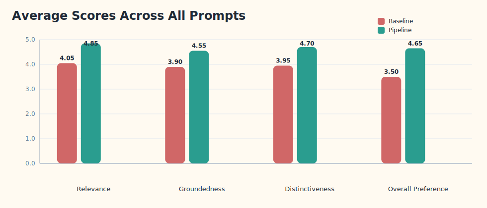
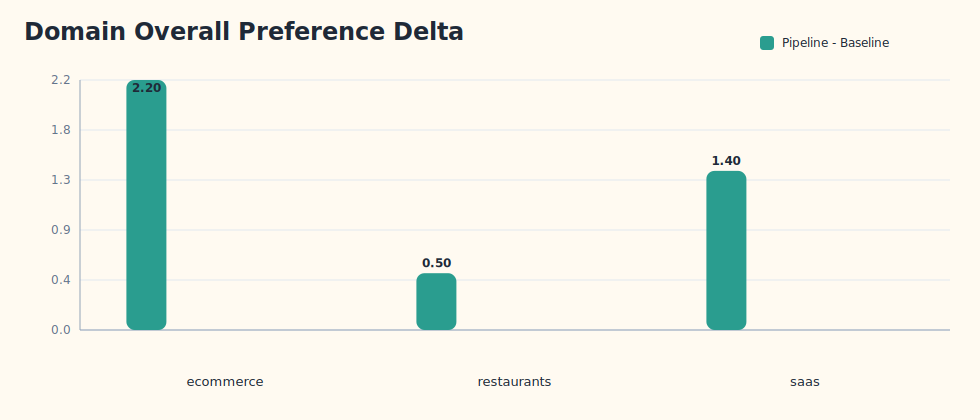
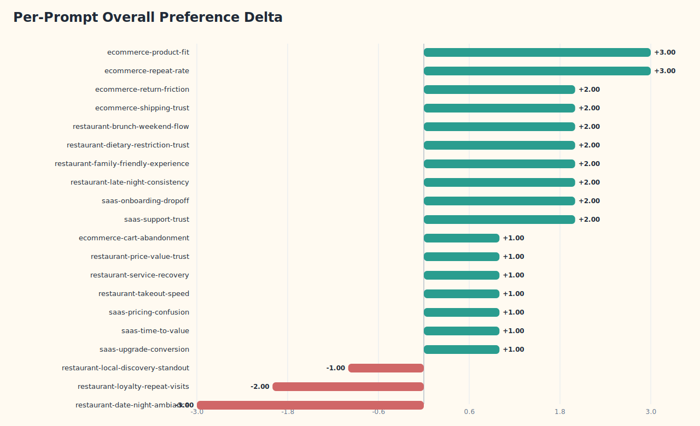
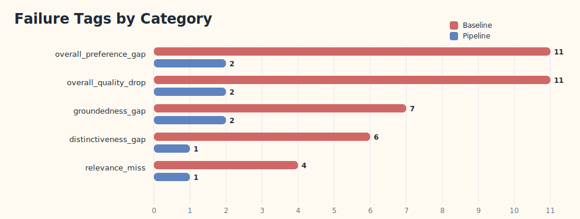
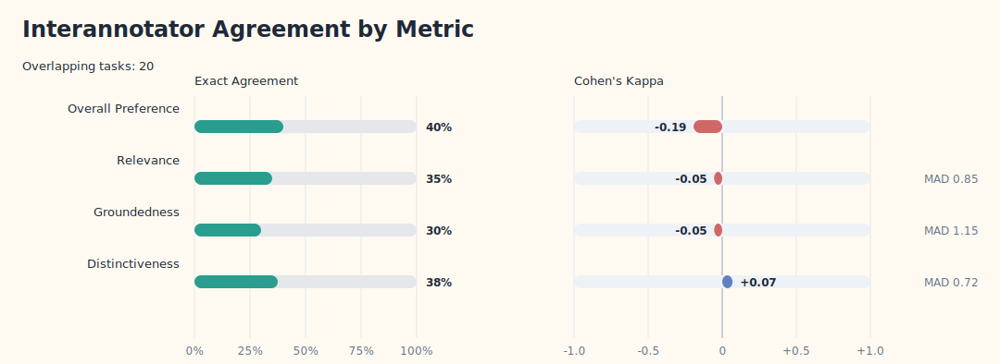
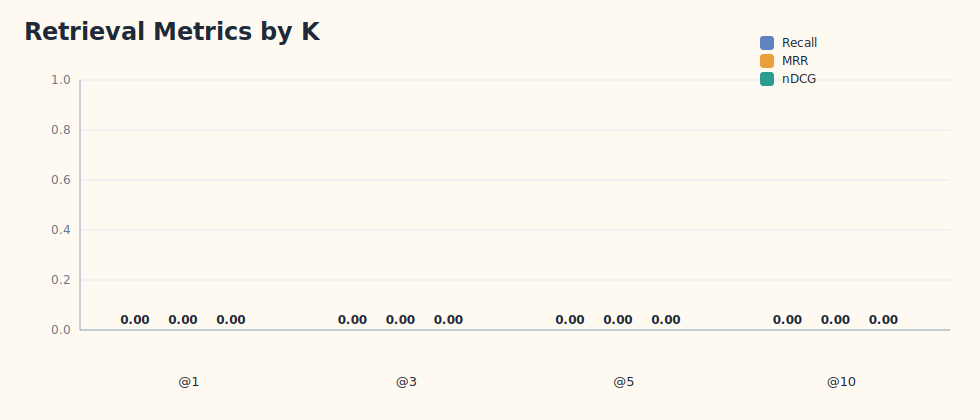

# Final Analysis Report

**Generated:** 2026-03-15T23:13:10.471576+00:00
**Runs dir:** `artifacts\runs`
**Summary JSON:** [`final_analysis_summary.json`](final_analysis_summary.json)

## Executive Summary

- Pipeline wins `17` of `20` evaluated prompts; baseline wins `3`, ties `0`.
- Top-line `overall_preference` improved from `3.50` to `4.65` (`+1.15`).
- Judge panel mode: `disabled (single judge)`.
- Human annotation spans `2` annotators across `20` overlapping tasks; `overall_preference` agreement is `40.00%` (`kappa = -0.194`).

## Artifact Status

| Family | Status | Detail |
|---|---|---|
| evaluation_runs | complete | 20 current-schema prompt evaluations loaded. |
| failure_taxonomy | complete | failure_tags.jsonl present and summarized. |
| retrieval_eval | complete | Loaded retrieval benchmark from reports\research_upgrade\retrieval_eval_summary.json. |
| prompt_sweep | excluded | Existing prompt-sweep artifacts use the pre-migration rubric schema and were excluded: control, evidence-budget, fewer-points, strict-quoting. |
| human_annotation | complete | Agreement analysis available for 2 annotators across 20 overlapping tasks. |
| variant_runs | missing | No variant runs artifacts found. |
| robustness_runs | missing | No robustness runs artifacts found. |

## Figures

### Aggregate rubric scores

### Domain-level overall preference deltas

### Prompt-level overall preference deltas

### Failure-tag concentration by system

### Interannotator agreement

### Retrieval benchmark metrics

## Score Summary

| Metric | Baseline | Pipeline | Delta |
|---|---:|---:|---:|
| Relevance | 4.05 | 4.85 | +0.80 |
| Groundedness | 3.90 | 4.55 | +0.65 |
| Distinctiveness | 3.95 | 4.70 | +0.75 |
| Overall Preference | 3.50 | 4.65 | +1.15 |

## Domain Breakdown

| Domain | Prompts | Pipeline Wins | Baseline Wins | Baseline Overall | Pipeline Overall | Delta |
|---|---:|---:|---:|---:|---:|---:|
| ecommerce | 5 | 5 | 0 | 2.60 | 4.80 | +2.20 |
| restaurants | 10 | 7 | 3 | 3.90 | 4.40 | +0.50 |
| saas | 5 | 5 | 0 | 3.60 | 5.00 | +1.40 |

## Strongest Gains

| Prompt | Domain | Overall Delta |
|---|---|---:|
| ecommerce-product-fit | ecommerce | +3.00 |
| ecommerce-repeat-rate | ecommerce | +3.00 |
| ecommerce-return-friction | ecommerce | +2.00 |
| ecommerce-shipping-trust | ecommerce | +2.00 |
| restaurant-brunch-weekend-flow | restaurants | +2.00 |

## Regressions

| Prompt | Domain | Overall Delta |
|---|---|---:|
| restaurant-date-night-ambiance | restaurants | -3.00 |
| restaurant-loyalty-repeat-visits | restaurants | -2.00 |
| restaurant-local-discovery-standout | restaurants | -1.00 |

## Failure Taxonomy

| Category | Total Tags | Baseline | Pipeline | Avg Severity | Max Severity |
|---|---:|---:|---:|---:|---:|
| overall_preference_gap | 13 | 11 | 2 | 4.23 | 5 |
| overall_quality_drop | 13 | 11 | 2 | 4.23 | 5 |
| groundedness_gap | 9 | 7 | 2 | 4.11 | 5 |
| distinctiveness_gap | 7 | 6 | 1 | 4.14 | 5 |
| relevance_miss | 5 | 4 | 1 | 4.20 | 5 |

### Highest-severity Prompt Failures

| Prompt | Tag Count | Max Severity | Variants | Categories |
|---|---:|---:|---|---|
| ecommerce-product-fit | 4 | 5 | baseline | groundedness_gap, overall_preference_gap, overall_quality_drop, relevance_miss |
| ecommerce-repeat-rate | 3 | 5 | baseline | overall_preference_gap, overall_quality_drop, relevance_miss |
| ecommerce-return-friction | 3 | 5 | baseline | distinctiveness_gap, overall_preference_gap, overall_quality_drop |
| restaurant-date-night-ambiance | 3 | 5 | pipeline | groundedness_gap, overall_preference_gap, overall_quality_drop |
| restaurant-loyalty-repeat-visits | 5 | 4 | pipeline | distinctiveness_gap, groundedness_gap, overall_preference_gap, overall_quality_drop, relevance_miss |

## Retrieval Evaluation

- Queries evaluated: `2`
- Mode: `hybrid` | Reranker: `token_overlap`

| Metric | @1 | @3 | @5 | @10 |
|---|---:|---:|---:|---:|
| Recall | 0.5000 | 1.0000 | 1.0000 | 1.0000 |
| MRR | 0.5000 | 0.6667 | 0.6667 | 0.6667 |
| nDCG | 0.5000 | 0.7500 | 0.7500 | 0.7500 |

## Human Annotation

- Task batch size: `20`
- Compatible completed tasks: `20`
- Legacy completed tasks: `0`
- Tracked export files: `2`

| Annotator | Autosave Current | Autosave Legacy | Export Current | Export Legacy |
|---|---:|---:|---:|---:|
| reviewer_01 | 20 | 0 | 20 | 0 |
| reviewer_02 | 0 | 0 | 20 | 0 |

### Interannotator Agreement

- Overlapping tasks: `20`

| Metric | Samples | Exact Agreement | Cohen's Kappa |
|---|---:|---:|---:|
| overall_preference | 20 | 40.00% | -0.194 |

### Rubric Agreement

| Dimension | Samples | Exact Agreement | Mean Abs Diff | Quadratic Weighted Kappa |
|---|---:|---:|---:|---:|
| relevance | 40 | 35.00% | 0.850 | -0.164 |
| groundedness | 40 | 30.00% | 1.150 | -0.070 |
| distinctiveness | 40 | 37.50% | 0.725 | -0.088 |

### Judge Alignment vs LLM Judge

| Annotator | Samples | Exact Agreement | Cohen's Kappa | Human A | Human B | Human Tie | Judge A | Judge B | Judge Tie |
|---|---:|---:|---:|---:|---:|---:|---:|---:|---:|
| reviewer_01 | 20 | 70.00% | 0.341 | 7 | 13 | 0 | 7 | 13 | 0 |
| reviewer_02 | 20 | 35.00% | -0.294 | 8 | 11 | 1 | 7 | 13 | 0 |

## Exclusions And Caveats

- Prompt sweep: Existing prompt-sweep artifacts use the pre-migration rubric schema and were excluded: control, evidence-budget, fewer-points, strict-quoting.
- Variant and robustness suites are reported only if their artifact directories exist; they were not part of the completed run set in this workspace snapshot.
- Human validation is included, but interannotator overall-preference agreement is only 40.00% (`kappa = -0.194`), so calibration claims remain fragile.

## Warnings

- Existing prompt-sweep artifacts use the pre-migration rubric schema and were excluded: control, evidence-budget, fewer-points, strict-quoting.
